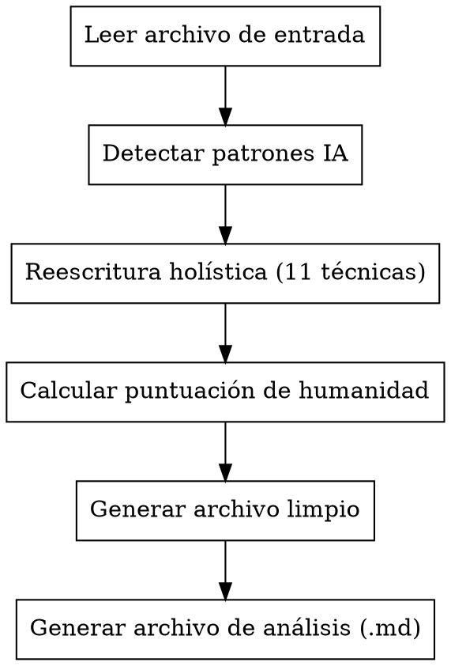

# Humanizar Texto IA en Español

## Visión general

Reescribe de forma holística texto en español generado por IA aplicando 11 técnicas lingüísticas simultáneas para aumentar su perplejidad y burstiness, haciéndolo indistinguible de escritura humana natural. Genera siempre dos archivos de salida: uno limpio y uno de análisis.

## Cuándo usar

- El usuario proporciona un archivo `.pdf`, `.docx`, `.md` o `.txt` en español
- El texto fue generado por IA (ChatGPT, Claude, Gemini, etc.)
- El objetivo es investigar la evasión de detectores de IA

**No usar para:** texto en inglés, texto ya humanizado, o textos muy cortos (< 100 palabras).

## Proceso



## Paso 1: Detectar patrones IA antes de reescribir

Identifica en el texto original:
- Enumeraciones mecánicas ("En primer lugar… En segundo lugar… En tercer lugar…")
- Frases formulaicas: *"Es importante destacar que"*, *"Adicionalmente, se observa"*, *"Cabe mencionar que"*
- Ritmo de frases uniforme (todas de longitud similar)
- Vocabulario neutro y excesivamente culto sin variación
- Ausencia de subjetividad, opinión o emoción
- Listas con bullet points o estructuras paralelas

## Paso 2: Reescritura holística — 11 técnicas simultáneas

Aplica todas en una sola pasada. No hagas múltiples pasadas.

| # | Técnica | Cómo aplicarla |
|---|---|---|
| 1 | **Reformulación sintáctica** | Varía estructura de oraciones; mezcla simples y compuestas |
| 2 | **Control de burstiness** | Alterna frases muy cortas (3-6 palabras) con frases largas (25-35 palabras) |
| 3 | **Control de perplejidad** | Usa palabras menos esperadas, giros creativos, vocabulario inusual pero natural |
| 4 | **Marcadores discursivos españoles** | Inserta: *eso sí*, *la verdad es que*, *al fin y al cabo*, *sin ir más lejos*, *es que*, *mira*, *aunque claro*, *y ya está*, *no sé*, *vamos* |
| 5 | **Regla 70/30 de vocabulario** | Mantén 70-80% del vocabulario consistente; varía el 20-30% restante especialmente en adjetivos descriptivos y verbos de acción |
| 6 | **Variación estilística y de registro** | Alterna momentos de tono formal académico con otros más conversacionales |
| 7 | **Elementos emocionales y subjetivos** | Añade opiniones puntuales, juicios de valor, pequeñas reacciones emocionales |
| 8 | **Referencias concretas y específicas** | Sustituye ejemplos genéricos por referencias específicas o hipotéticas concretas |
| 9 | **Eliminar listas y estructuras paralelas** | Convierte bullet points y enumeraciones en prosa integrada |
| 10 | **Imprecisiones humanas naturales** | Añade hedges: *más o menos*, *algo así*, *en cierta medida*, *no del todo*; pequeñas redundancias |
| 11 | **Errores tipográficos controlados** | Introduce 1-2 inconsistencias menores de puntuación o estilo (no errores ortográficos, solo naturalidad tipográfica) |

## Paso 3: Calcular puntuación de humanidad (0–100)

| Criterio | Puntos |
|---|---|
| Variación de longitud de frases (burstiness) | 25 |
| Uso de marcadores discursivos españoles | 20 |
| Variación de vocabulario (regla 70/30) | 20 |
| Elementos emocionales y subjetivos presentes | 20 |
| Ausencia de listas y estructuras paralelas | 15 |

Evalúa cada criterio de 0 al máximo de puntos asignado y suma.

## Paso 4: Generar los dos archivos de salida

### Archivo 1 — Texto limpio

**Nombre:** `{nombre_original}_humanizado.{ext}`

- Solo el texto humanizado, sin comentarios ni anotaciones
- Mismo formato que el input: TXT→TXT, MD→MD, DOCX→DOCX
- Si el input es PDF → generar como DOCX
- Mantener estructura original: títulos, párrafos, secciones

### Archivo 2 — Análisis de investigación

**Nombre:** `{nombre_original}_analisis.md`

Usar SIEMPRE esta estructura exacta:

```markdown
# Análisis de humanización

## Puntuación de humanidad estimada: XX/100

### Desglose
| Criterio | Puntuación |
|---|---|
| Variación de longitud de frases (burstiness) | X/25 |
| Uso de marcadores discursivos | X/20 |
| Variación de vocabulario (70/30) | X/20 |
| Elementos emocionales/subjetivos | X/20 |
| Ausencia de listas y estructuras paralelas | X/15 |

## Patrones IA detectados en el original
- [lista de patrones encontrados]

## Cambios aplicados
| Técnica | Fragmento original | Fragmento humanizado |
|---|---|---|
| [técnica] | [texto original] | [texto nuevo] |

## Texto humanizado completo
[texto completo humanizado]
```

## Errores comunes

| Error | Corrección |
|---|---|
| Nombrar archivo `texto_humanizado.txt` | Usar `{nombre_original}_humanizado.{ext}` |
| Análisis en `.txt` | Siempre `.md` con la estructura de tablas exacta |
| No calcular puntuación numérica | Obligatorio: desglose por los 5 criterios |
| Hacer múltiples pasadas | Una sola reescritura holística |
| Mantener enumeraciones ("En primer lugar…") | Convertir siempre a prosa integrada |
| Solo aplicar reformulación | Aplicar las 11 técnicas simultáneamente |
