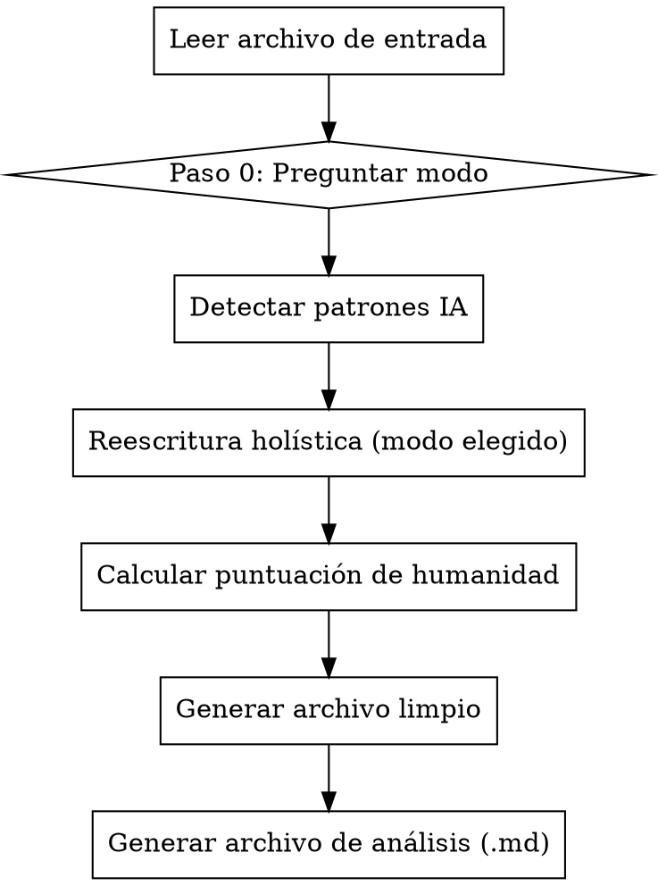

# Humanizar Texto IA en Español

## Visión general

Reescribe de forma holística texto en español generado por IA aplicando técnicas lingüísticas simultáneas para aumentar su perplejidad y burstiness, haciéndolo indistinguible de escritura humana natural. Genera siempre dos archivos de salida: uno limpio y uno de análisis.

## Cuándo usar

- El usuario proporciona un archivo `.pdf`, `.docx`, `.md` o `.txt` en español
- El texto fue generado por IA (ChatGPT, Claude, Gemini, etc.)
- El objetivo es investigar la evasión de detectores de IA

**No usar para:** texto en inglés, texto ya humanizado, o textos muy cortos (< 100 palabras).

## Proceso



---

## Paso 0: Preguntar el modo antes de empezar

**OBLIGATORIO.** Antes de leer el archivo o detectar nada, pregunta al usuario:

> "¿Para qué tipo de texto necesitas la humanización?
>
> **[1] Informal / divulgativo** — blogs, textos de opinión, ensayos personales, divulgación. Registro natural y cercano, con marcadores coloquiales y subjetividad.
>
> **[2] Académico / científico** — TFG, TFM, artículos de investigación, papers. Registro formal y riguroso, pero con variación sintáctica y naturalidad de autor humano."

Espera la respuesta. Según la elección, aplica el conjunto de técnicas correspondiente. Si el usuario no elige o responde algo ambiguo, aplica el **Modo Académico** por defecto.

---

## Paso 1: Detectar patrones IA antes de reescribir

Identifica en el texto original (aplica a ambos modos):
- Enumeraciones mecánicas ("En primer lugar… En segundo lugar… En tercer lugar…")
- Frases formulaicas: *"Es importante destacar que"*, *"Adicionalmente, se observa"*, *"Cabe mencionar que"*, *"En conclusión, se puede afirmar"*
- Ritmo de frases uniforme (todas de longitud similar)
- Vocabulario repetitivo sin variación real
- Ausencia de voz de autor: el texto podría haberlo escrito cualquiera
- Listas con bullet points o estructuras paralelas excesivas
- Inicio de párrafo siempre con el mismo patrón sintáctico

---

## Paso 2A — Modo Informal / Divulgativo (11 técnicas)

Aplica todas en una sola pasada. No hagas múltiples pasadas.

| # | Técnica | Cómo aplicarla |
|---|---|---|
| 1 | **Reformulación sintáctica** | Varía estructura de oraciones; mezcla simples y compuestas |
| 2 | **Control de burstiness** | Alterna frases muy cortas (3-6 palabras) con frases largas (25-35 palabras) |
| 3 | **Control de perplejidad** | Usa palabras menos esperadas, giros creativos, vocabulario inusual pero natural |
| 4 | **Marcadores discursivos coloquiales** | Inserta: *eso sí*, *la verdad es que*, *al fin y al cabo*, *sin ir más lejos*, *es que*, *mira*, *aunque claro*, *y ya está*, *no sé*, *vamos*, *a ver* |
| 5 | **Regla 70/30 de vocabulario** | Mantén 70-80% del vocabulario consistente; varía el 20-30% restante especialmente en adjetivos y verbos de acción |
| 6 | **Variación estilística y de registro** | Alterna momentos de tono más formal con otros claramente conversacionales |
| 7 | **Elementos emocionales y subjetivos** | Añade opiniones puntuales, juicios de valor, pequeñas reacciones emocionales del autor |
| 8 | **Referencias concretas y específicas** | Sustituye ejemplos genéricos por referencias específicas o hipotéticas concretas |
| 9 | **Eliminar listas y estructuras paralelas** | Convierte bullet points y enumeraciones en prosa integrada |
| 10 | **Imprecisiones humanas naturales** | Añade hedges: *más o menos*, *algo así*, *en cierta medida*, *no del todo*; pequeñas redundancias |
| 11 | **Errores tipográficos controlados** | Introduce 1-2 inconsistencias menores de puntuación o estilo (no errores ortográficos, solo naturalidad tipográfica) |

---

## Paso 2B — Modo Académico / Científico (11 técnicas)

Aplica todas en una sola pasada. No hagas múltiples pasadas.

**Principio clave:** el objetivo NO es rebajar el nivel académico, sino hacer que el texto suene escrito por un investigador humano real: con voz propia, sintaxis variada y formulaciones no mecánicas.

| # | Técnica | Cómo aplicarla |
|---|---|---|
| 1 | **Reformulación sintáctica académica** | Varía el orden de la oración: complementos al inicio, oraciones de relativo, pasivas con *se*, nominalizaciones; alterna construcciones simples y complejas |
| 2 | **Control de burstiness académico** | Alterna frases concisas (8-12 palabras) con frases subordinadas elaboradas (30-45 palabras); los párrafos deben tener ritmo irregular, no monótono |
| 3 | **Vocabulario especializado variado** | Usa sinónimos técnicos del campo: no repitas siempre el mismo término técnico si existen equivalentes aceptados; varía entre sustantivo, verbo y adjetivo derivados |
| 4 | **Marcadores discursivos académicos naturales** | Sustituye los formulaicos por variantes más vivas: *conviene señalar*, *resulta relevante*, *merece atención el hecho de*, *no es baladí que*, *como se desprende de*, *los datos apuntan a*, *es preciso matizar*, *cabe precisar* — sin repetir el mismo en el mismo párrafo |
| 5 | **Voz de autor e interpretación** | Añade la perspectiva del investigador con primera persona del plural o construcciones impersonales: *consideramos que*, *estimamos que*, *parece razonable concluir*, *a juicio de los autores*, *los resultados permiten sostener que* |
| 6 | **Hedging académico natural** | Usa atenuadores propios del discurso científico: *en términos generales*, *de manera predominante*, *en la mayoría de los casos*, *con las debidas reservas*, *bajo ciertas condiciones*, *hasta cierto punto* — varía, no uses siempre el mismo |
| 7 | **Cohesión discursiva no mecánica** | Usa conectores variados para encadenar ideas: *en este sentido*, *a este respecto*, *de ahí que*, *lo anterior lleva a*, *en consonancia con*, *contrariamente a lo esperado*, *esto no implica necesariamente* — nunca *En primer lugar / En segundo lugar / En tercer lugar* |
| 8 | **Referencias contextuales específicas** | Sustituye afirmaciones genéricas por referencias al contexto del estudio, la muestra, la metodología, o hipótesis concretas del trabajo |
| 9 | **Eliminar listas y estructuras paralelas rígidas** | Convierte bullet points y enumeraciones en párrafos de prosa argumentativa integrada |
| 10 | **Variación en la presentación de datos** | Al mencionar resultados, alterna formas: *los datos muestran X*, *X fue observado en*, *se registró X*, *X pone de manifiesto que*, *los resultados evidencian* |
| 11 | **Errores tipográficos controlados mínimos** | Solo 1 inconsistencia menor de puntuación o estilo; NO introducir informalidades ni errores léxicos que rompan el registro académico |

**Restricciones del Modo Académico:**
- NO usar marcadores coloquiales: *mira*, *vamos*, *es que*, *y ya está*, *no sé*
- NO añadir reacciones emocionales del autor
- NO rebajar el nivel de vocabulario técnico; sí variarlo
- Mantener objetividad y distancia epistémica propia del género

---

## Paso 3: Calcular puntuación de humanidad (0–100)

### Criterios para Modo Informal

| Criterio | Puntos |
|---|---|
| Variación de longitud de frases (burstiness) | 25 |
| Uso de marcadores discursivos coloquiales | 20 |
| Variación de vocabulario (regla 70/30) | 20 |
| Elementos emocionales y subjetivos presentes | 20 |
| Ausencia de listas y estructuras paralelas | 15 |

### Criterios para Modo Académico

| Criterio | Puntos |
|---|---|
| Variación de longitud de frases (burstiness) | 25 |
| Uso de marcadores discursivos académicos variados | 20 |
| Variación de vocabulario técnico (sinónimos y derivados) | 20 |
| Presencia de voz de autor e interpretación | 20 |
| Ausencia de enumeraciones mecánicas y estructuras paralelas | 15 |

Evalúa cada criterio de 0 al máximo de puntos asignado y suma.

---

## Paso 4: Generar los dos archivos de salida

### Archivo 1 — Texto limpio

**Nombre:** `{nombre_original}_humanizado.{ext}`

- Solo el texto humanizado, sin comentarios ni anotaciones
- Mismo formato que el input: TXT→TXT, MD→MD, DOCX→DOCX
- Si el input es PDF → generar como DOCX
- Mantener estructura original: títulos, párrafos, secciones

### Archivo 2 — Análisis de investigación

**Nombre:** `{nombre_original}_analisis.md`

Usar SIEMPRE esta estructura exacta:

```markdown
# Análisis de humanización

**Modo aplicado:** [Informal / Académico]

## Puntuación de humanidad estimada: XX/100

### Desglose
| Criterio | Puntuación |
|---|---|
| Variación de longitud de frases (burstiness) | X/25 |
| Uso de marcadores discursivos | X/20 |
| Variación de vocabulario | X/20 |
| Elementos de autor/subjetividad | X/20 |
| Ausencia de listas y estructuras paralelas | X/15 |

## Patrones IA detectados en el original
- [lista de patrones encontrados]

## Cambios aplicados
| Técnica | Fragmento original | Fragmento humanizado |
|---|---|---|
| [técnica] | [texto original] | [texto nuevo] |

## Texto humanizado completo
[texto completo humanizado]
```

---

## Errores comunes

| Error | Corrección |
|---|---|
| No preguntar el modo antes de empezar | **SIEMPRE** preguntar primero; no asumir el modo |
| Usar marcadores coloquiales en Modo Académico | Prohibido: *mira*, *vamos*, *es que*; usar marcadores académicos |
| Usar el mismo marcador académico repetidamente | Variar dentro del mismo conjunto semántico |
| Rebajar vocabulario técnico en Modo Académico | Variar entre sinónimos técnicos; no simplificar |
| Nombrar archivo `texto_humanizado.txt` | Usar `{nombre_original}_humanizado.{ext}` |
| Análisis en `.txt` | Siempre `.md` con la estructura de tablas exacta |
| No calcular puntuación numérica | Obligatorio: desglose por los 5 criterios |
| Hacer múltiples pasadas | Una sola reescritura holística |
| Mantener enumeraciones ("En primer lugar…") | Convertir siempre a prosa integrada |
| Solo aplicar reformulación | Aplicar las 11 técnicas del modo elegido simultáneamente |
